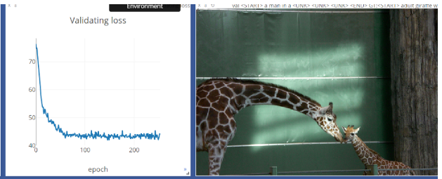

# image_to_capture_pytorch
My version of the cn231 model IMAGE2Caption re-coded using the PyTorch library

This is an attempt to learn some more pytorch by re-implementing the model from scratch.
Some functions provided by the cs231n course were used, and all the dataloaders for the COCO dataset are also from there.
The model generates text captures but currently the blue score is not very high, so I am planning to improve on that.
No attention is used, since I use encoded features provided by CS231n course (they are reduced by a PCA).
Otherwise, the model architecture is exactly as the one made in the course, so can be re-used for learning purposes.
The code here is stored only as a demo for myself, I hardly recommend to use it :)

